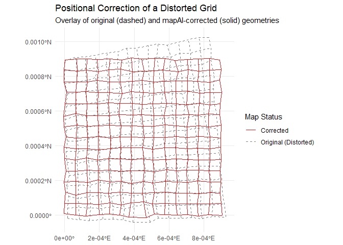
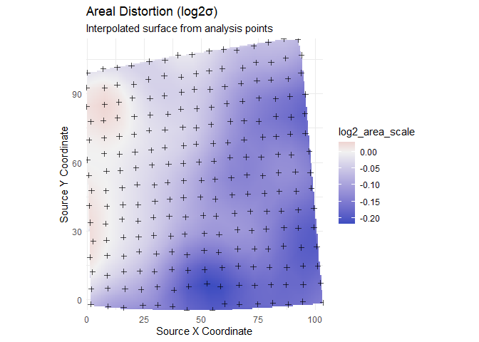

<!-- README.md is generated from README.Rmd. Please edit that file -->

# mapAI

<!-- badges: start -->

[](https://github.com/kvantas/mapAI)
[](https://doi.org/10.5281/zenodo.15767080)
[](https://codecov.io/gh/kvantas/mapAI)
[](https://lifecycle.r-lib.org/articles/stages.html#stable)
[](https://github.com/kvantas/mapAI/actions/workflows/R-CMD-check.yaml)
<!-- badges: end -->

The `mapAI` package provides a comprehensive, end-to-end toolkit in R
for the **Positional Accuracy Improvement (PAI)** of vector maps. The
package is designed for researchers and practitioners in Geoinformatics
and GIS who need not only to to improve the geometric quality of vector
maps but also to understand and quantify the nature of their geometric
distortions.

## Overview

The `mapAI` framework allows you to:

1.  **Import Data**: Easily load distorted vector maps and their
    corresponding homologous points (GCPs).
2.  **Train a Model**: Select from a suite of PAI models (`helmert`,
    `lm`, `tps`, `rf`, `gam`) to learn the distortion pattern.
3.  **Acess the Model’s Performance**: Perform k-fold cross-validation
    to provide a robust estimate of a PAI model’s predictive
    performance, using both random and spatial CV methods.
4.  **Correct Geometry**: Apply the trained model to warp the historical
    map into its corrected geometric state.
5.  **Analyze and Explain**: Use advanced distortion analysis functions,
    based on Tissot’s indicatrix theory, to quantify *how* the model
    handles the the map’s distortions. This allows for deeper
    cartographic and historical insights, turning the model from a black
    box into an explanatory tool.
6.  **Export Results**: Save the corrected map to standard geospatial
    file formats.

## Installation

You can install the development version of `mapAI` from
[GitHub](https://github.com/) using the `pak` package:

``` r
# install.packages("pak")
pak::pak("kvantas/mapAI")
```

## Core Workflow: A Complete Example

This example demonstrates the primary workflow. We will first generate a
synthetic dataset representing a distorted map and then use the
package’s functions to correct it.

### 1. Load Libraries and Create Demo Data

We begin by using `create_demo_data()` to generate a test case with
complex, noisy distortions.

``` r
library(mapAI)
library(sf)
#> Linking to GEOS 3.13.0, GDAL 3.8.5, PROJ 9.5.1; sf_use_s2() is TRUE
library(ggplot2)

# Generate a shapefile and a GCPs CSV with complex noisy distortions
# The function returns a list containing the paths to these new files.
demo_files <- create_demo_data(type = "complex", seed = 42)
#>    -> Homologous points saved to: /var/folders/yh/kq6cp_457lg059f3l02r57s80000gn/T//Rtmp4Clda7/demo_gcps.csv
#>    -> Distorted map saved to: /var/folders/yh/kq6cp_457lg059f3l02r57s80000gn/T//Rtmp4Clda7/demo_map.shp
```

### 2. Read Data and Train a Model

We load the generated files and train a **Generalized Additive Model
(`gam`)**, which is ideal for capturing the smooth, non-linear
distortions present in the demo data.

``` r
# Load the homologous points (GCPs) and the distorted vector map
gcp_data <- read_gcps(gcp_path = demo_files$gcp_path, crs = 2100)
map_to_correct <- read_map(shp_path = demo_files$shp_path, crs = 2100)

# Train the GAM model using the GCPs
gam_model <- train_pai_model(gcp_data, method = "gam")
#> Training 'gam' model...
```

### 3. Apply Correction and Visualize

We apply the trained model to our distorted grid. The resulting plot,
which overlays the corrected grid on the original, provides a clear
visual confirmation of what the model does to the distorted map.

``` r
# Apply the model to the distorted map
corrected_map <- apply_pai_model(gam_model, map_to_correct)
#> Applying PAI model to map features...
#> Correction complete.

# For easy plotting, add a 'status' column and combine the maps
map_to_correct$status <- "Original (Distorted)"
corrected_map$status <- "Corrected"
comparison_data <- rbind(map_to_correct[, "status"], corrected_map[, "status"])

# Create the final comparison plot
ggplot(comparison_data) +
  geom_sf(aes(color = status, linetype = status), fill = NA, linewidth = 0.7) +
  scale_color_manual(name = "Map Status", values = c("Original (Distorted)" = "grey50", "Corrected" = "#e41a1c")) +
  scale_linetype_manual(name = "Map Status", values = c("Original (Distorted)" = "dashed", "Corrected" = "solid")) +
  labs(title = "Positional Correction of a Distorted Grid",
       subtitle = "Overlay of original (dashed) and mapAI-corrected (solid) geometries") +
  theme_minimal()
```



------------------------------------------------------------------------

## From Correction to Explanation: Advanced Distortion Analysis

A key challenge with data-driven models is understanding *what* they
have learned. `mapAI` directly addresses this by providing tools to
“open the black box” and analyze the properties of the learned
transformation.

### 4. Quantify and Visualize the Distortion Field

The `analyze_distortion()` function computes local distortion metrics
across the map space. This allows us to move from a simple visual
assessment to a quantitative map of the distortion.

``` r
# 1. Create a grid of points for analysis using the pipe (%>%)
library(magrittr)
analysis_points <- sf::st_make_grid(gcp_data, n = c(25, 25)) %>%
  sf::st_centroid() %>%
  sf::st_sf()

# 2. Analyze the distortion using our trained GAM model
distortion_results <- analyze_distortion(gam_model, analysis_points)

# 3. Plot the distortion surfaces
plot_area <- plot_distortion_surface(
  distortion_results, metric = "log2_area_scale", diverging = TRUE
) + labs(title = "Areal Distortion (log2σ)")

plot_shear <- plot_distortion_surface(
  distortion_results, metric = "max_shear"
) + labs(title = "Maximum Shear Distortion (°)")

# Combine plots using the patchwork library
if (requireNamespace("patchwork", quietly = TRUE)) {
  plot_area + plot_shear
} else {
  plot_area
}
```


These plots provide a detailed map of where the model learned to apply
the most significant stretching, shrinking, and shearing, offering
insights that may correlate with physical map degradation or historical
cartographic techniques.

By providing these tools, `mapAI` empowers researchers to not only
correct their historical maps with high accuracy but also to gain a
deeper, quantitative understanding of their geometric properties.
