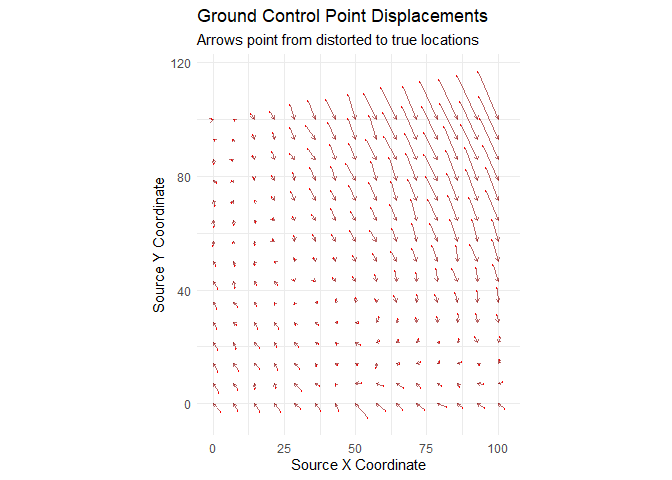
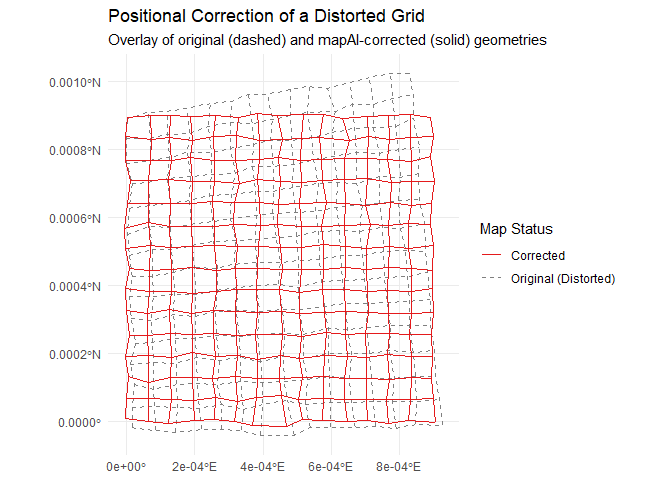
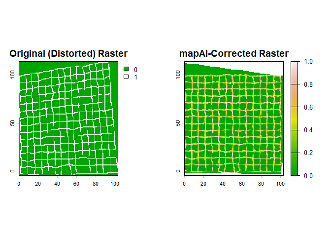
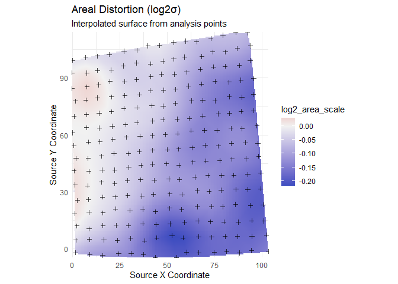
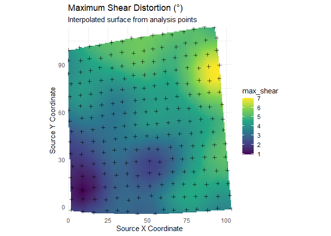
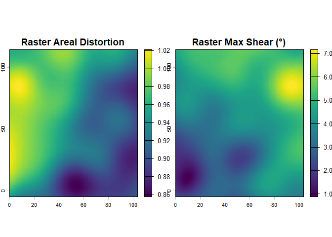

<!-- README.md is generated from README.Rmd. Please edit that file -->

# mapAI

<!-- badges: start -->

[](https://github.com/kvantas/mapAI)
[](https://doi.org/10.5281/zenodo.15767080)
[](https://lifecycle.r-lib.org/articles/stages.html#stable)
[](https://github.com/kvantas/mapAI/actions/workflows/R-CMD-check.yaml)
<!-- badges: end -->

The `mapAI` package is designed to provide a comprehensive and
accessible PAI (positional accuracy improvement) framework for vector
and raster geospatial data.

## Overview

The `mapAI` package provides a comprehensive and accessible framework
for Positional Accuracy Improvement (PAI) of both vector (`sf`) and
raster (`terra::SpatRaster`) geospatial data. This package’s main
contributions are:

1)  the unification of a set of PAI methods from classical adjustments
    to statistical and machine learning algorithms, within a framework
    engineered to modify the geometry of vector features and spatial
    alignment of raster maps;

2)  the application of modern best practices regarding predictive
    accuracy assessment using various validation methods, and;

3)  the integration of distortion analysis into the PAI workflow for
    both vector and raster data, providing powerful diagnostics.

## Installation

You can install the development version of `mapAI` from
[GitHub](https://github.com/) using the `pak` package:

``` r
# install.packages("pak")
pak::pak("kvantas/mapAI")
```

## Core Workflow: A Complete Example

This example demonstrates the primary workflow. We will first generate a
synthetic dataset representing a distorted map and then use the
package’s functions to correct it.

### 1. Load Libraries and Create Demo Data

We begin by using `create_demo_data()` to generate a test case with
complex, noisy distortions.

``` r
library(mapAI)
library(sf)
#> Linking to GEOS 3.14.1, GDAL 3.12.1, PROJ 9.7.1; sf_use_s2() is TRUE
library(ggplot2)

# Generate a shapefile and a GCPs CSV with complex noisy distortions
# The function returns a list containing the paths to these new files.
demo_data <- create_demo_data(type = "complex", seed = 1)


# plot the distortion data
plot(demo_data$gcp, main = "Homologous Points (GCPs)")
```



### 2. Read Data and Train a Model

We load the generated files and train a **Generalized Additive Model
(`gam`)**, which is ideal for capturing the smooth, non-linear
distortions present in the demo data.

``` r
# Load the homologous points (GCPs) and the distorted vector map
gcp_data <- demo_data$gcp
map_to_correct <- demo_data$map

# Train a bivariate GAM model using the GCPs
gam_model <- train_pai_model(gcp_data, "gam_biv")
#> Training Bivariate GAM model...
```

### 3. Apply Correction and Visualize

We apply the trained model to our distorted grid. The resulting plot,
which overlays the corrected grid on the original, provides a clear
visual confirmation of what the model does to the distorted map.

``` r
# Apply the model to the distorted map
corrected_map <- transform_map(gam_model, map_to_correct)
#> Applying PAI model to map features...
#> Correction complete.

# For easy plotting, add a 'status' column and combine the maps
map_to_correct$status <- "Original (Distorted)"
corrected_map$status <- "Corrected"
comparison_data <- rbind(map_to_correct[, "status"], corrected_map[, "status"])

# Create the final comparison plot
ggplot(comparison_data) +
  geom_sf(aes(color = status, linetype = status), fill = NA, linewidth = 0.7) +
  scale_color_manual(name = "Map Status", values = c("Original (Distorted)" = "grey50", "Corrected" = "#e41a1c")) +
  scale_linetype_manual(name = "Map Status", values = c("Original (Distorted)" = "dashed", "Corrected" = "solid")) +
  labs(title = "Positional Correction of a Distorted Grid",
       subtitle = "Overlay of original (dashed) and mapAI-corrected (solid) geometries") +
  theme_minimal()
```



### 4. Correcting Raster Maps (In-Memory)

The same trained PAI model can also be applied directly to rectify
continuous or categorical raster data (e.g., scanned historical paper
maps, aerial photographs, or digital elevation models) using
`terra::SpatRaster`.

All raster transformations operate strictly in memory without creating
temporary files:

``` r
library(terra)

# Generate demo data including an in-memory raster map
demo_raster_data <- create_demo_data(type = "complex", seed = 1, raster = TRUE)
distorted_raster <- demo_raster_data$raster

# Apply the trained model to correct the raster
# Uses inverse mapping with bilinear interpolation
corrected_raster <- transform_map(
  gam_model,
  distorted_raster,
  method = "bilinear"
)

# Visualize original vs. corrected raster side-by-side
par(mfrow = c(1, 2))
terra::plot(distorted_raster, main = "Original (Distorted) Raster", col = terrain.colors(50))
terra::plot(corrected_raster, main = "mapAI-Corrected Raster", col = terrain.colors(50))
par(mfrow = c(1, 1))
```



Key raster capabilities: - **Inverse (Backward) Mapping**: Projects
regular target grid cell centers backward into the source image space,
eliminating holes and pixel collisions. - **Continuous & Categorical
Support**: Uses `"bilinear"` interpolation for continuous surfaces and
`"near"` (nearest neighbor) for discrete thematic layers. - **Fast Mesh
Subsampling (`mesh_step`)**: Enables high-performance warping on large
rasters with sub-pixel precision. - **Pure In-Memory Operations**:
Entirely preserves RAM efficiency with zero disk overhead.

------------------------------------------------------------------------

## From Correction to Explanation: Advanced Distortion Analysis

A key challenge with data-driven models is understanding *what* they
have learned. `mapAI` directly addresses this by providing tools to
“open the black box” and analyze the properties of the learned
transformation.

### 5. Quantify and Visualize the Distortion Field

The `analyze_distortion()` function computes local distortion metrics
across the map space. This allows us to move from a simple visual
assessment to a quantitative map of the distortions that the model
learns.

``` r
# 1. Analyze the distortion using our trained GAM model on GCPs
distortion_results <- analyze_distortion(gam_model, gcp_data)

# 2. Plot the distortion surfaces interpolating the values on gcp's location
plot(distortion_results,
     metric = "area_scale",
     diverging = TRUE) +
  labs(title = "Areal Distortion")
```



``` r

plot(
  distortion_results, metric = "max_shear"
) + 
  labs(title = "Maximum Shear Distortion (°)")
```



`analyze_distortion()` also evaluates distortion directly on in-memory
`terra::SpatRaster` objects, returning an 8-layer raster containing all
Tissot indicatrix metrics:

``` r
# Evaluate distortion across all cell centers of the raster
raster_distortion <- analyze_distortion(gam_model, newdata = distorted_raster)

# Plot key distortion metric layers directly from the raster
terra::plot(raster_distortion[[c("area_scale", "max_shear")]],
            main = c("Raster Areal Distortion", "Raster Max Shear (°)"))
```



## Meta

- Bug reports, suggestions, and code are welcome.

- License:

  - All code is licensed MIT.
