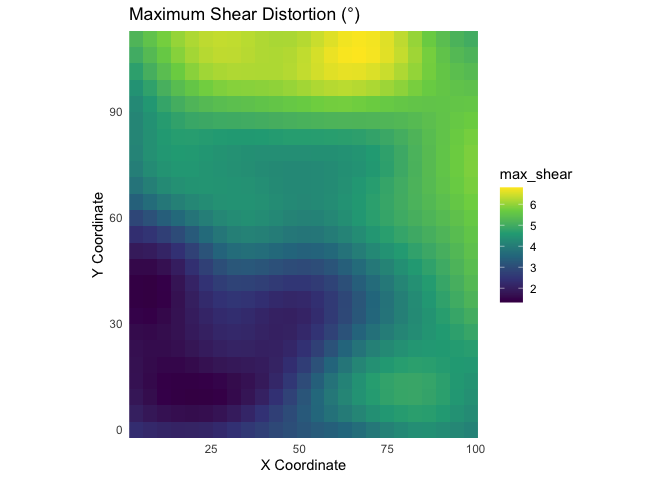

<!-- README.md is generated from README.Rmd. Please edit that file -->

# mapAI

<!-- badges: start -->

[](https://github.com/kvantas/mapAI)
[](https://doi.org/10.5281/zenodo.15767080)
[](https://lifecycle.r-lib.org/articles/stages.html#stable)
[](https://github.com/kvantas/mapAI/actions/workflows/R-CMD-check.yaml)
<!-- badges: end -->

The `mapAI` package is designed to provide a comprehensive and
accessible PAI (positional accuracy improvement) framework for vector
geospatial data.

## Overview

The `mapAI` package provides a comprehensive and accessible framework
for Positional Accuracy Improvement (PAI) of vector geospatial data.
This package’s main contributions are:

1)  the unification of a set of PAI methods from classical adjustments
    to statistical and machine learning algorithms, within a framework
    engineered to modify the geometry of spatial features;

2)  the application of modern best practices regarding predictive
    accuracy assessment using;

3)  the integration of distortion analysis into the PAI workflow,
    providing powerful diagnostics.

## Installation

You can install the development version of `mapAI` from
[GitHub](https://github.com/) using the `pak` package:

``` r
# install.packages("pak")
pak::pak("kvantas/mapAI")
```

## Core Workflow: A Complete Example

This example demonstrates the primary workflow. We will first generate a
synthetic dataset representing a distorted map and then use the
package’s functions to correct it.

### 1. Load Libraries and Create Demo Data

We begin by using `create_demo_data()` to generate a test case with
complex, noisy distortions.

``` r
library(mapAI)
library(sf)
#> Linking to GEOS 3.13.0, GDAL 3.8.5, PROJ 9.5.1; sf_use_s2() is TRUE
library(ggplot2)

# Generate a shapefile and a GCPs CSV with complex noisy distortions
# The function returns a list containing the paths to these new files.
demo_files <- create_demo_data(type = "complex", seed = 42)
#>    -> Homologous points saved to: /var/folders/yh/kq6cp_457lg059f3l02r57s80000gn/T//RtmpdMBIVM/demo_gcps.csv
#>    -> Distorted map saved to: /var/folders/yh/kq6cp_457lg059f3l02r57s80000gn/T//RtmpdMBIVM/demo_map.shp
```

### 2. Read Data and Train a Model

We load the generated files and train a **Generalized Additive Model
(`gam`)**, which is ideal for capturing the smooth, non-linear
distortions present in the demo data.

``` r
# Load the homologous points (GCPs) and the distorted vector map
gcp_data <- read_gcps(gcp_path = demo_files$gcp_path)
map_to_correct <- read_map(shp_path = demo_files$shp_path)
#> Reading layer `demo_map' from data source 
#>   `/private/var/folders/yh/kq6cp_457lg059f3l02r57s80000gn/T/RtmpdMBIVM/demo_map.shp' 
#>   using driver `ESRI Shapefile'
#> Simple feature collection with 30 features and 1 field
#> Geometry type: LINESTRING
#> Dimension:     XY
#> Bounding box:  xmin: -0.3737642 ymin: -4.996873 xmax: 102.7303 ymax: 115.3157
#> Projected CRS: WGS 84 / Pseudo-Mercator

# Train the GAM model using the GCPs
gam_model <- train_pai_model(gcp_data, pai_method = "gam")
#> Training 'gam' model...
```

### 3. Apply Correction and Visualize

We apply the trained model to our distorted grid. The resulting plot,
which overlays the corrected grid on the original, provides a clear
visual confirmation of what the model does to the distorted map.

``` r
# Apply the model to the distorted map
corrected_map <- apply_pai_model(gam_model, map_to_correct)
#> Applying PAI model to map features...
#> Correction complete.

# For easy plotting, add a 'status' column and combine the maps
map_to_correct$status <- "Original (Distorted)"
corrected_map$status <- "Corrected"
comparison_data <- rbind(map_to_correct[, "status"], corrected_map[, "status"])

# Create the final comparison plot
ggplot(comparison_data) +
  geom_sf(aes(color = status, linetype = status), fill = NA, linewidth = 0.7) +
  scale_color_manual(name = "Map Status", values = c("Original (Distorted)" = "grey50", "Corrected" = "#e41a1c")) +
  scale_linetype_manual(name = "Map Status", values = c("Original (Distorted)" = "dashed", "Corrected" = "solid")) +
  labs(title = "Positional Correction of a Distorted Grid",
       subtitle = "Overlay of original (dashed) and mapAI-corrected (solid) geometries") +
  theme_minimal()
```


------------------------------------------------------------------------

## From Correction to Explanation: Advanced Distortion Analysis

A key challenge with data-driven models is understanding *what* they
have learned. `mapAI` directly addresses this by providing tools to
“open the black box” and analyze the properties of the learned
transformation.

### 4. Quantify and Visualize the Distortion Field

The `analyze_distortion()` function computes local distortion metrics
across the map space. This allows us to move from a simple visual
assessment to a quantitative map of the distortion.

``` r
# 1. Create a grid of points for analysis using the pipe (%>%)
library(magrittr)
analysis_points <- sf::st_make_grid(gcp_data, n = c(25, 25)) %>%
  sf::st_centroid() %>%
  sf::st_sf()

# 2. Analyze the distortion using our trained GAM model
distortion_results <- analyze_distortion(gam_model, analysis_points)

# 3. Plot the distortion surfaces
plot_area <- plot_distortion_surface(
  distortion_results, metric = "log2_area_scale", diverging = TRUE
) + labs(title = "Areal Distortion (log2σ)")

plot_shear <- plot_distortion_surface(
  distortion_results, metric = "max_shear"
) + labs(title = "Maximum Shear Distortion (°)")

# Show the plots
plot_area
```


``` r
plot_shear
```



## Meta

- Bug reports, suggestions, and code are welcome.

- License:

  - All code is licensed MIT.
